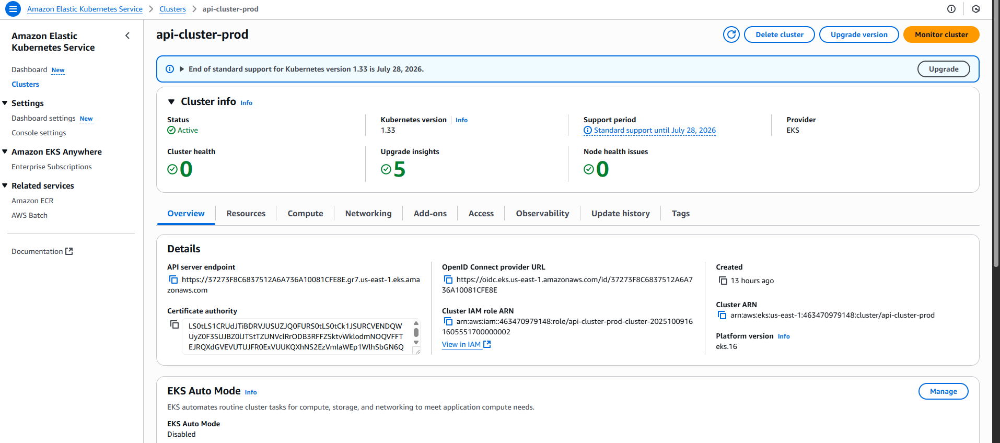
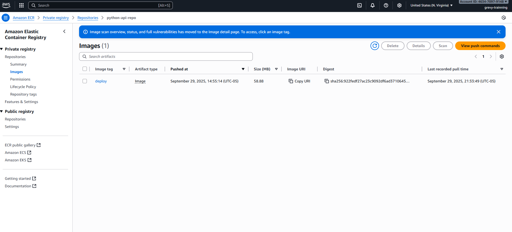
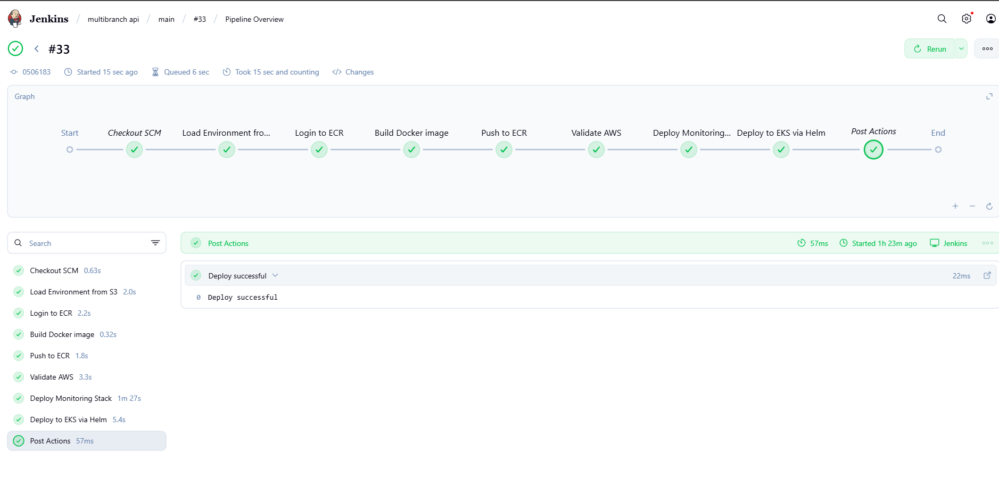
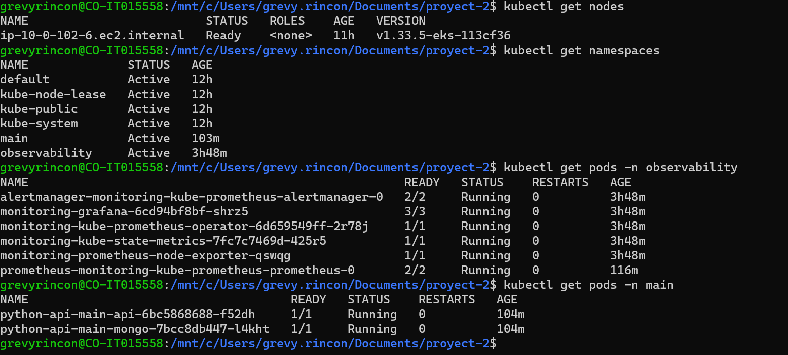
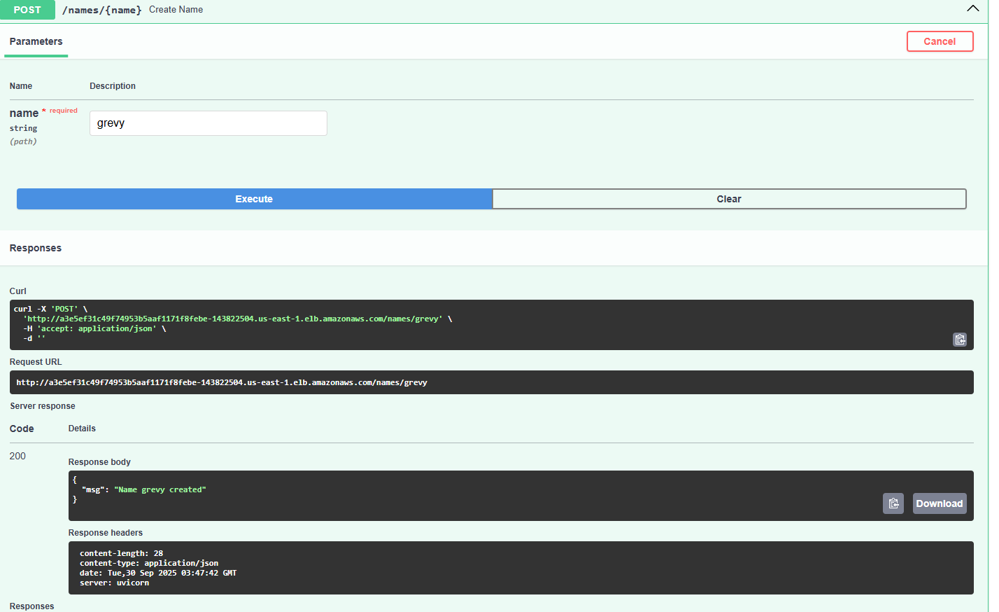
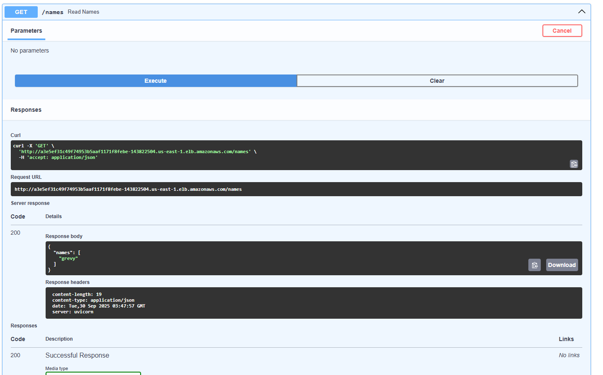
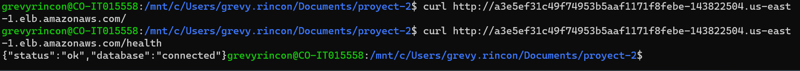

# EKS Cluster - Devops

I'm really glad with the development of this project. I feel that I learned a lot from all the mistakes I made during this project. I gained valuable experience in creating infrastructure on AWS Cloud.

This project contains an application using Docker, Helm, Terraform, and Jenkins to orchestrate and deploy a cluster into AWS Cluster using AWS eks and ECR.

---

## Project Structure

- `app/` - Application code and Dockerfile.
- `helm-chart/` - Helm chart to deploy the application and MongoDB.
- `images/` - Project screenshots and diagrams.
- `terraform/` - Terraform scripts for infrastructure.

---

## Project Images

### Cluster

### Amazon ECR

### Jenkins

### Kubectl

### Tests
create a name

get the names

validate health endpoint

---
